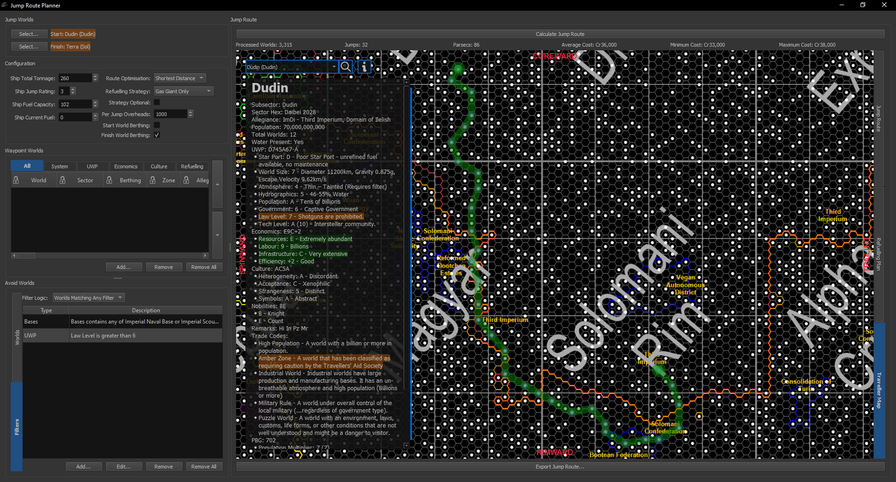
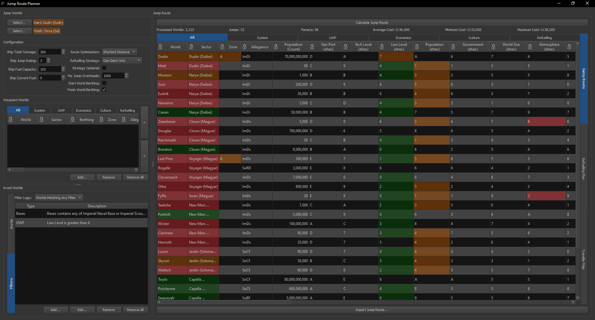
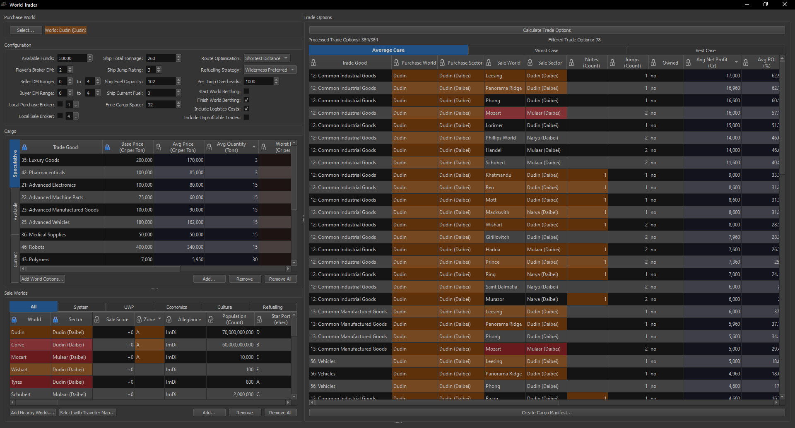
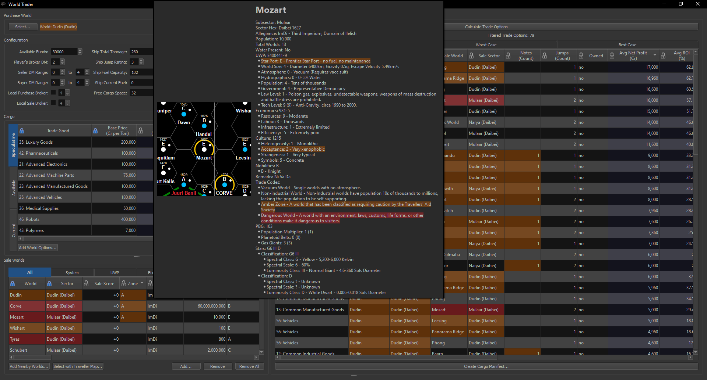
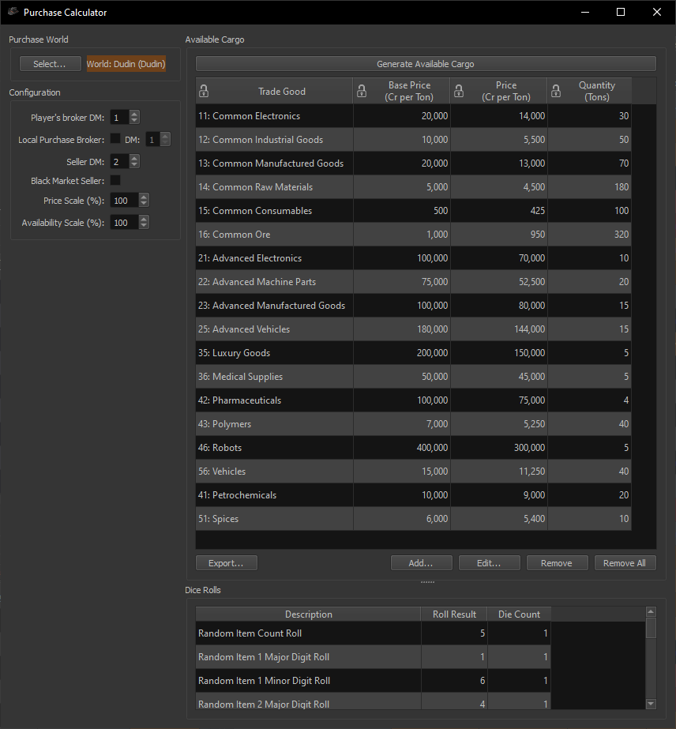
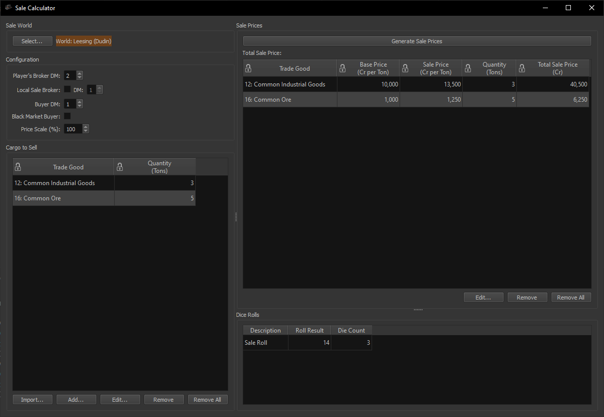
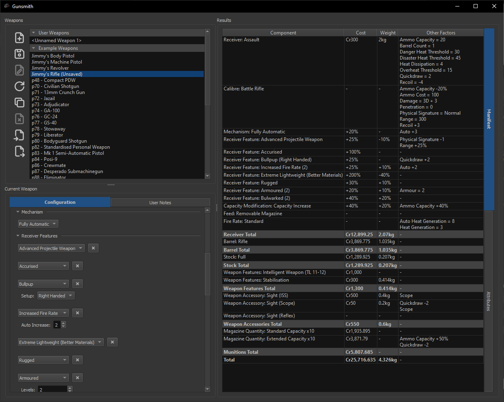
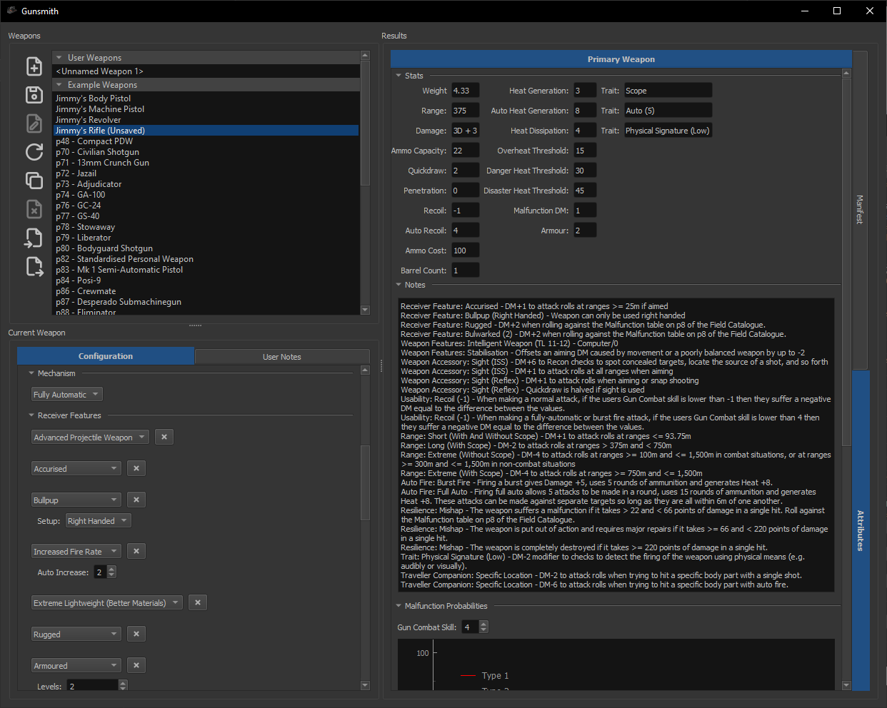
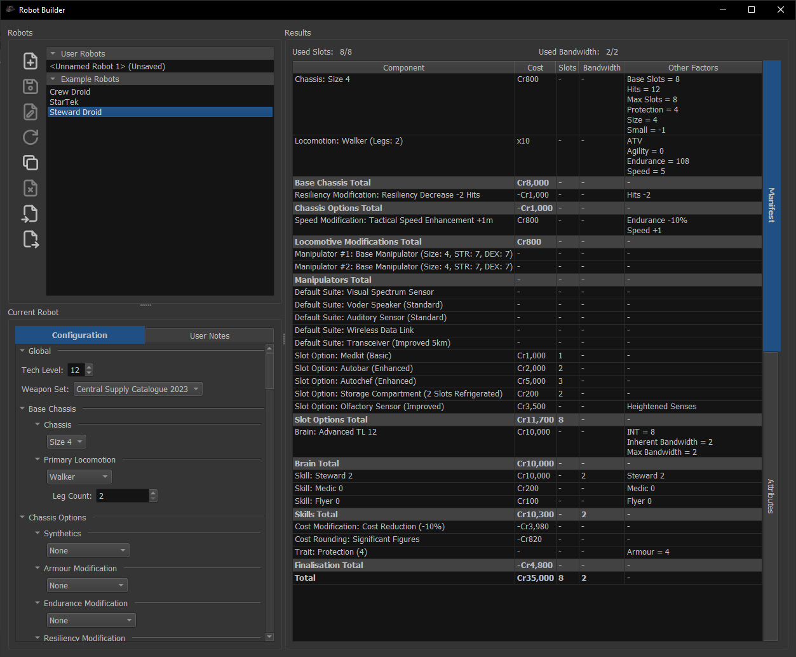
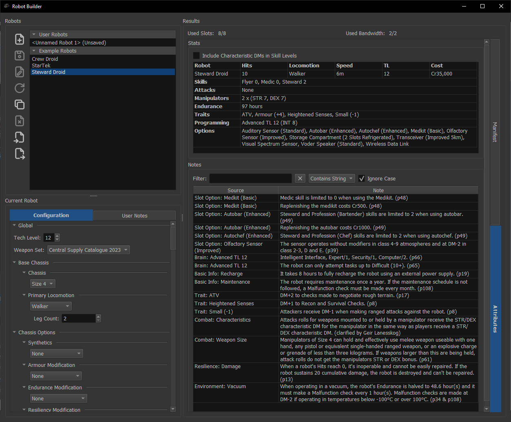

# Screenshots

Jump Route Planner window showing the route covering the shortest distance from Dudin to Terra at
Jump-3, only refuelling at gas giants and avoiding worlds with a Law Level over 6 and/or an Imperial
Scout or Navy base.

Jump Route Planner window showing list of worlds along route

World Trader window showing Trade Options when purchasing goods on Dudin

World Information tool tip with configurable attribute based highlighting

Purchase Calculator window showing Trade Goods for sale by a seller on Dudin

Sale Calculator window showing sale prices for a buyer on Leesing

Gunsmith window showing manifest for Jimmy's rifle

Gunsmith window showing attributes and automatically generated notes for Jimmy's rifle

Robot Builder window showing manifest for example Steward Droid

Robot Builder window showing attributes and automatically generated notes for example Steward Droid
